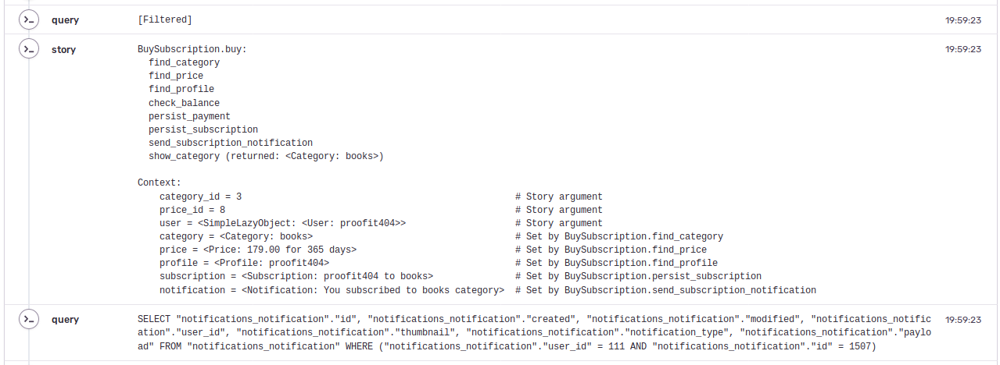

# Sentry contrib

This is a picture of the execution path and context variables of the business
object shown in the error report breadcrumbs section:



## Settings

Import this module **before** import any Sentry related stuff:

```pycon

>>> import stories.contrib.sentry

```

## Django Settings

If you use Django, you should add this section to your project config instead of
the import statement documented above:

```pycon

>>> SENTRY_CLIENT = "stories.contrib.sentry.django.DjangoClient"

```

<p align="center">&mdash; ⭐️ &mdash;</p>
<p align="center"><i>The stories library is part of the SOLID python family.</i></p>
